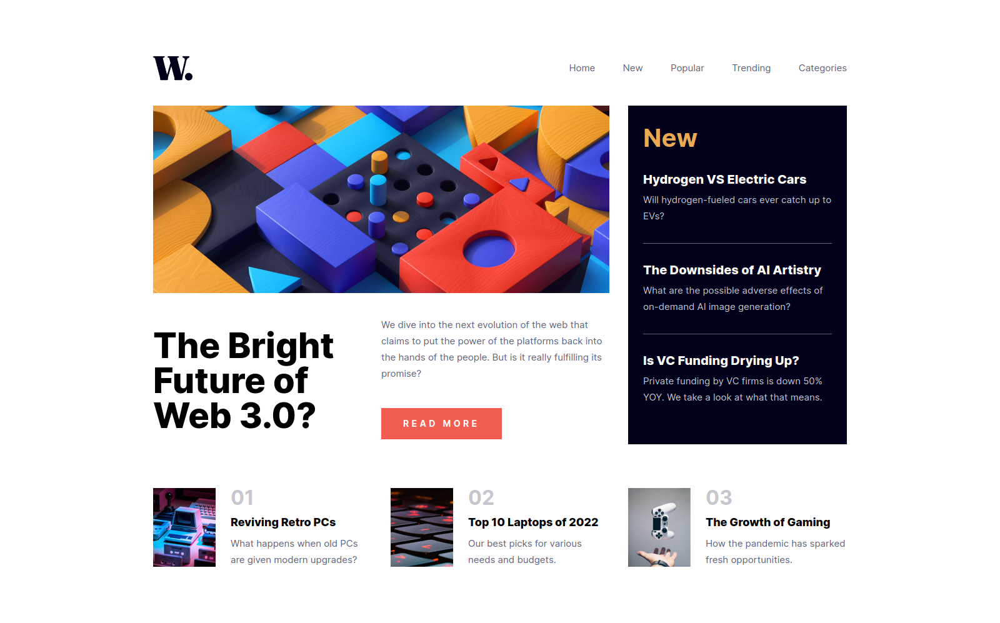
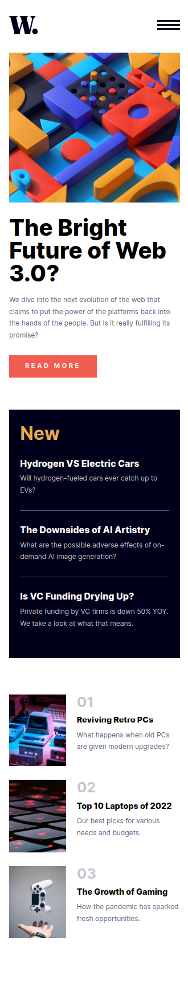
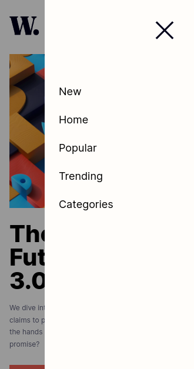

# Frontend Mentor - News homepage solution

This is a solution to the [News homepage challenge on Frontend Mentor](https://www.frontendmentor.io/challenges/news-homepage-H6SWTa1MFl). Frontend Mentor challenges help you improve your coding skills by building realistic projects.

## Table of contents

- [Overview](#overview)
  - [The challenge](#the-challenge)
  - [Screenshot](#screenshot)
  - [Links](#links)
- [My process](#my-process)
  - [Built with](#built-with)
  - [What I learned](#what-i-learned)
  - [Continued development](#continued-development)
  - [Useful resources](#useful-resources)
- [Author](#author)
- [Acknowledgments](#acknowledgments)

## Overview

### The challenge

Users should be able to:

- View the optimal layout for the interface depending on their device's screen size
- See hover and focus states for all interactive elements on the page

### Screenshot

### Links

- Solution URL: [Frontend Mentor | News homepage](https://your-solution-url.com)
- Live Site URL: [News homepage](https://sasanqc.github.io/news-homepage/)

## My process

### Built with

- Semantic HTML5 markup
- CSS custom properties
- CSS Grid
- Desktop-first workflow
- Sass

### What I learned

### Continued development

### Useful resources

- [Advanced CSS and Sass: Flexbox, Grid, Animations and More!](https://www.udemy.com/course/advanced-css-and-sass/) - This helped me to learn sass deeply. jonas teaches advanced concepts very good.

- [Kevin Powell Youtube Channel](https://www.youtube.com/channel/UCJZv4d5rbIKd4QHMPkcABCw) - This helped me to learn sass. also i learned sass file structure in a big project

## Author

- Github - [@sasanqc](https://github.com/sasanqc/)
- Frontend Mentor - [@sasanqc](https://www.frontendmentor.io/profile/sasanqc)
- Twitter - [@sasanqc](https://www.twitter.com/sasanqc)
- Linkedin - [@sasanqc](https://www.linkedin.com/in/sasanqc)

## Acknowledgments
